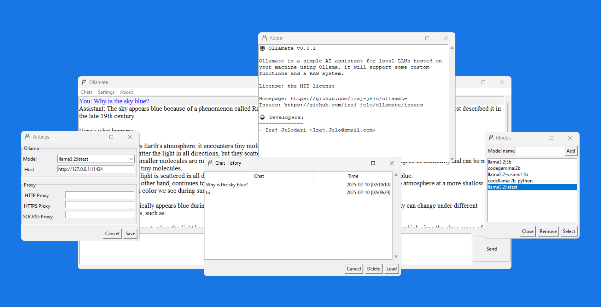

 

#  Ollamate

**Ollamate** (A playful combination of "Ollama" and "mate" implying a helpful companion ) is an **AI assistant**, using [Ollama](https://ollama.com) to run your favorite LLMs locally as your assistant.

It support an user-friendly GUI, making interaction with Ollama easier and more gentle than before. Additionally in future, it will support a simple RAG system and multiple different tools making daily routine tasks a no-brainer. 

<small>"This project is licensed under the terms of the MIT license."</small>

<hr>

### 💻 How To Use It

First, install the app using:

```bash
pip install ollamate
```

Then, before running the following command, make sure that you are running Ollama on your system and pulled your desired LLM model from [here](https://ollama.com/library).

⚠️ Notice that you may encounter **errors** such as:
 ```
 ImportError: No module named ‘Tkinter’
 ```
 or 
 ```
 ModuleNotFoundError: No module named 'tkinter' in Python
 ```
which are explained in the next section.

To run the app:

```bash
ollamate
```
Or simply run:

```bash
om
```

<hr>

### Q/A

#### I'm getting ImportError or ModuleNotFoundError errors.

The errors:
```
ImportError: No module named 'tkinter'
```
or 
```
ModuleNotFoundError: No module named 'tkinter' in Python
```

These happen due to lack of the Tk library on your machine: 

For **Ubuntu**:

```
sudo apt-get install python3-tk
```

For **Fedora**:

```
sudo dnf install python3-tkinter
```

For **macOS**:

```
brew install python-tk
```

#### How can I contribute in this project?

- **Fork** the project
- Make your **changes**
- Build a **pull-request** on the our main project's repository